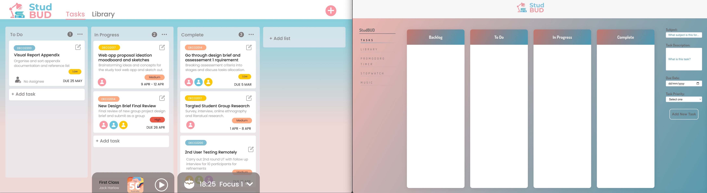
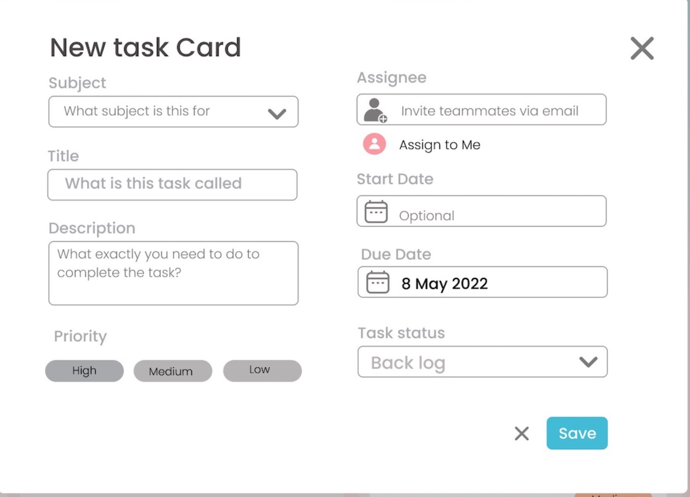
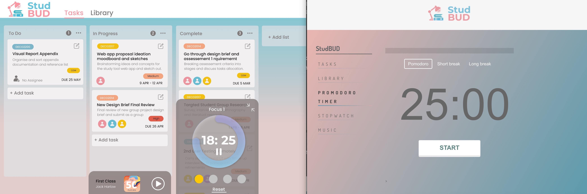
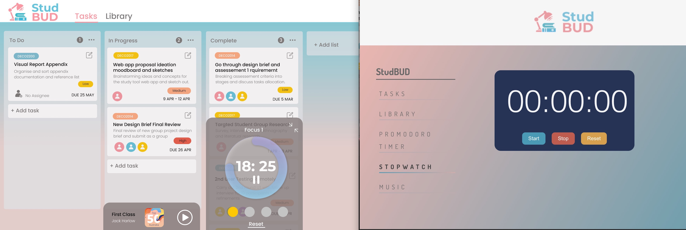
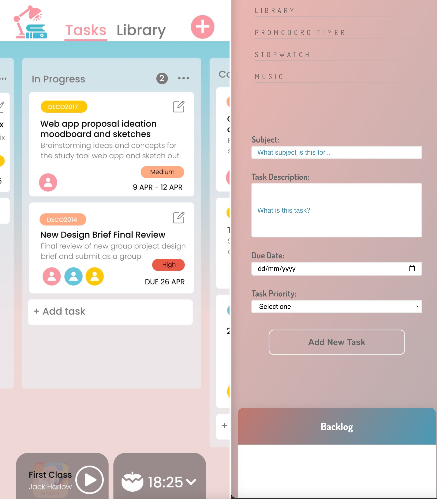
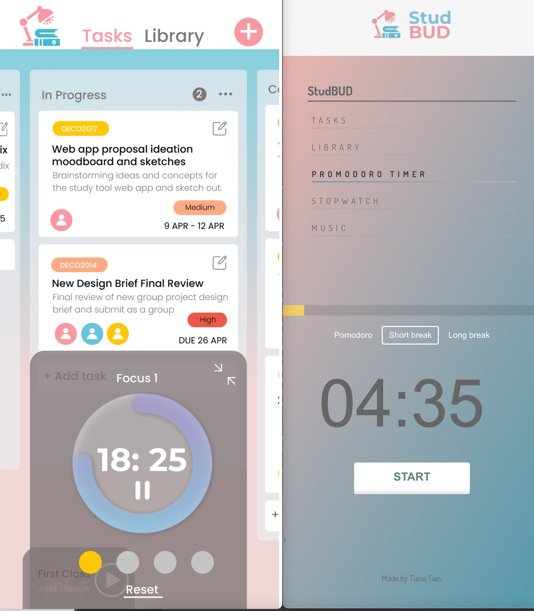

# StudBud
 
Web App Prototype Documentation

By Tiana Tian
* note that there has been an issue with VS code that as the safe writing featuers, while running the watcher program, saving files in Visual Studio does not trigger the watcher to rebuild assets. Therefore before I submitted the assessment, the issue has not been fixed and the dist folder has only picked up changes in the previous week and does not inlcude functional stopwatch and pomodoro timer page, please kindly use local html file to review. 

# Web App Concept

StudBud is an online study tool that aims to help design students better manage their design projects and tasks.

* With easy access from all devices, StudBud puts users' project work at their fingertips to take quick action and stay on track at all times
* Providing a kanban board to manage students' study process through oroganising to-dos, monitoring WIP, coordinating tasks and workload and hitting the deadline. 
* StudBud wish to use "Promodoro Timer" and "Stopwatch" to improve student concentration and productivity
* And encourage them to take proper rest in between study sessions with the embedded music player (optional)
* It also provides a mini documentation library to store frequented learning materials (optional)

# Website Design Refinement

Based on self-refection and general feedback from peers and tutor, few suggestions bebfore creating the prototype.

## Feedback:
1. The original web app visual style was too complicated and with all functions, tags, pop-up tags in one place makes users hard to navigate around the page.
2. During user testing with the hifi mockup, many design students felt the mini library function was not really useful but add extra works when organising their studies. As most of them access their learning material from Canvas, online, or youtube where there are multiple entries for adding "favorite" documents. Therefore they found the process of manually adding links, uploading files to the StudBuD app is time consuming and less effective. 
3. The idea of pop-up tags was exciting however, some users found it distracted when it is located within the main page and hard to notice the time changes when it sits at the bottom with smaller font size.
4. Also the horizontal scrolling in mobile version is not inline with modern practice - suggest to change to vertical scroll in mobile screen

## Iteration 1

With a few changes, the overall look of the landing page changes in to a more __minimalistic__, __effective__ layout.

 

* The __nav bar__ has been changed from horizontal at the top to vertial on the left side
* __Simplify__ the __process of adding new task__ by creating a permanent new task form section on the right side
* Choose a __darker background colour__ to enhance the contrast of contents overall and make the kanban board contents more obvious

## Iteration 2
While building up the tasklist properties, considered the general feedback from potential design student users, I removed the "Start date" and "Assignee" from the form.

 

* design projects often take longer time to complete and it is difficult to make a clear "start date" for them, a clear reminer of due date will be sufficient for design student for now, it is the ability of tracking WIP that the kanban board provided that matters to design students and most. 
* Sharing their to-do list and WIP with other teammates create extra pressures for some design students and they prefer to work in their own pace, therfore they hope to keep this web app for individual use only

## Iteration 3
Put stopwatch and pomodoro timer into seperate web pages instead of as pop-up taps in the main page to help user get clear view of the timer and be more focused 

 
 

## Iteration 4
Considering the modern practice of mobile browsing - the mobile version has been changed from horizontal scroll to vertical scroll

## Iteration 5
Display the different stages of pomodoro timer at once with progression bar at the top so users can clearly know where they are in the focused study session. 

 

## Iteration 6
At the end of the development, the mini library concept has been rejected as it does not provide extra values to potential users in a practical way, further ideation will be needed in order to improve the functionality of the web app. 

# Development Highlight

## Dev roadmap
I graduately build the whole site in the following steps:
1. create basic task list
2. make the task list interactive
3. create basic page layout (inspired by [DECO2017 Week 5 example](https://replit.com/@robdongas/AJAX-and-APIs-Solution)
4. build columns for kanban board
5. create drag and drop js functions (inspired by [Todo App + Drag&Drop in Vanilla JS](https://www.youtube.com/watch?v=pz7bO9_lsGo)
6. set up responsive screen
7. set up local web server and bundler tool (JSON, express, parcel)
8. create stopwatch html structure, css styles and js functions (inspired by [Simple stopwatch timer](https://www.youtube.com/watch?v=49f1cjZWRJA)
9. create pomodoro timer html structure, css styles and js functions (inspired by[Pomodoro tutorial](https://freshman.tech/pomodoro-timer/)
10. write detailed README file

## Developing responsive website
It is important to have responsive screen for my web app as it means to be accessible from anywhere. Therefore I have ensure all items in the app is responsible to create a smooth navigation experience.

## Single CSS vs multiple CSS files
Single css or multiple specific css consideration
https://stackoverflow.com/questions/2336302/single-huge-css-file-vs-multiple-smaller-specific-css-files

## Button/Link Feedback
Another worth mentioning point during the prototype is to add dynamic changes to button or link when users interact with their cursor. 

## Errors after using Parcel - changes do not update in dist folder
Strangely after installing Parcel when I completed the tasklist page, every changes to my code afterwards did not picked up in the "dist" folder anymore, therefore when I run my page through the local server, I can not see the latest update. After research online, I figured out that it maybe becasue of the "safe-write" functions embedded in some text editers. 

And here is some possible solution discussion on github:
* https://github.com/parcel-bundler/website/issues/53
* https://github.com/parcel-bundler/parcel/issues/221
* https://github.com/parcel-bundler/parcel/pull/238

Saving changes does not trigger watchers. Saving same file in Notepad triggers watchers
https://developercommunity.visualstudio.com/t/saving-changes-does-not-trigger-watchers-saving-sa/209768

How to disable safewrite in webpack and parcel
https://webpack.js.org/guides/development/#choosing-a-development-tool
https://webpack.js.org/guides/development/#adjusting-your-text-editor
https://parceljs.org/features/development/

# Reflection and Limitation

One valuable lesson learned is the necessity of ongoing ideate and iteration throughout the entire design process. Everytime I make a loop back to "ideation" again, my idea gets more concrete. And more importanty to consistantly commit any modular changes to my code so I could have a clear track of the developments and progress overall.

 

However, within the limited timeframe, I was unable to create the music player. And as the concept of having a mini library has been rejected after user testing, my web app is lacking function to further support their study session in depth. I will continue developing my concepts in the future with extra research.  

A lof of the ideas and codes were inspired from existing project management tools and themes example and modified to fit into my proposal website app design, as in future learning, I hope I could have more original ideas. 

# Reference list 

### CSS Style skills and inspiration
How to style common form elements with css
https://www.digitalocean.com/community/tutorials/how-to-style-common-form-elements-with-css

CSS tricks
https://css-tricks.com/almanac/properties/w/width/

CSS Styling Images
https://www.w3schools.com/css/css3_images.asp

## Explore different ways of building a Kanban board 

### With Frameworks 
Create Kanban UI using NextJS and TailwindCSS in 20 minutes.
https://www.youtube.com/watch?v=ERXS6CROWR4

How to Create a Sidebar in Next.js & Tailwind CSS
https://www.youtube.com/watch?v=ooy92nDRHzU

Install Tailwind CSS with Next.js
https://tailwindcss.com/docs/guides/nextjs

### Vanilla JS (NO frameworks)

Todo App + Drag&Drop in Vanilla JS
https://www.youtube.com/watch?v=pz7bO9_lsGo

How to Build a Kanban Board with JavaScript (No Frameworks)
https://www.youtube.com/watch?v=ijQ6dCughW8

Animation support for Kanban dnd
https://www.youtube.com/watch?v=-Y-I7omRpaY

Frontend Mentor Challenge Advanced Todo with Drag and Drop Vanilla Javascript
https://www.youtube.com/watch?v=lZE0Qydl4ko

### Stopwatch coding inspiration

Learn HTML, CSS & JavaScript by coding a Stopwatch | A beginner tutorial
https://www.youtube.com/watch?v=49f1cjZWRJA

### Pomodoro Timer coding inspiration

https://freshman.tech/pomodoro-timer/

Create Pomodoro Timer using Javascript
https://www.youtube.com/watch?v=a7Kt7S_4HOA

Code a Pomodoro Javascript App With Me And Tools I Use To Stay Productive
https://www.youtube.com/watch?v=8VRNSIc4VeQ

Creating a Pomodoro Timer in JavaScript in 10 Lines of Code
https://levelup.gitconnected.com/creating-a-pomodoro-timer-in-javascript-in-10-lines-of-code-868f577be63c

### Music player coding inspiration

Build a Music Player | Vanilla JavaScript
https://www.youtube.com/watch?v=QTHRWGn_sJw

Create a Music Player using JavaScript
https://www.geeksforgeeks.org/create-a-music-player-using-javascript/